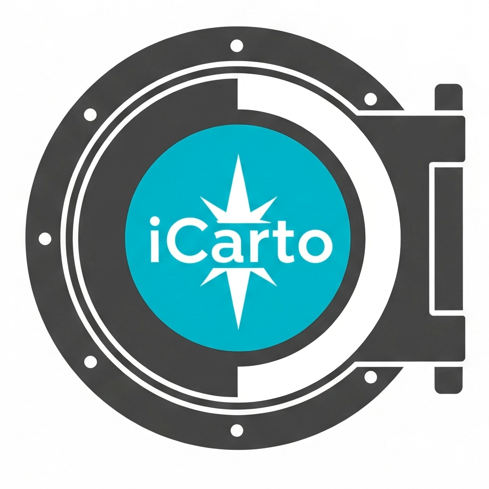

# readi-backups-doc

`readi-backups-doc` es la guía base sobre copias de seguridad de [iCarto](https://icarto.es).

Usamos esta guía cómo punto de partida a partir del cual implementamos estrategias concretas y documentación adaptadas a cada cliente.

El objetivo de esta guía es proporcionar prácticas efectivas para implementar sistemas de backup robustos pero sencillos de mantener, con un equilibrio entre seguridad, eficiencia operativa y costes.

## Qué es `readi`

`readi` son las siglas de "Rapid Enterprise Application Development by iCarto". `readi` es también un juego de palabras con `ready`

`readi` es una forma dogmática (_opinionated_) de hacer software. Un conjunto de librerías, patrones, metodologías o prácticas en general de como se construye software en iCarto.

## Créditos

-   La página web es un sitio estático implementado con [mkdocs-material](https://github.com/squidfunk/mkdocs-material)

*   Texto y código: Copyright (C) 2025 iCarto. Bajo licencia CC-BY 4.0
*   Tipografía: [Roboto](https://fonts.google.com/specimen/Roboto/about), una tipografía creada por Christian Robertson para Google bajo licencia Apache 2.0.
*   Iconos:
    -   [Font Awesome Free 6.5.1](https://fontawesome.com/license/free). (Icons: CC BY 4.0, Fonts: SIL OFL 1.1, Code: MIT License) Copyright 2023 Fonticons, Inc
    -   [Material Design Icons](https://pictogrammers.com/library/mdi/) Bajo licencia Apache License 2.0
*   Otros logotipos y marcas serán propiedad de sus respectivos propietarios

---

Copyright (C) 2025 iCarto. Bajo licencia [CC-BY 4.0](https://creativecommons.org/licenses/by/4.0/).
